# FluxCD - Démonstration par l'exemple

## Abstract

Sur un cluster Kind 'propre', nous allons mettre en place FluxCD (ie. *'bootstrap'*) et lui faire gérer le déploiement et la mise à jour d'une application très simple que nous avons déjà utilisée pour tester le bon fonctionnement de notre Ingress controller Nginx lorsque nous avons installé notre cluster Kind en local.

!!! note
    https://kind.sigs.k8s.io/docs/user/ingress/#ingress-nginx

Plusieurs étapes viendront jalonner notre chemin jusqu'à l'automatisation complète du déploiement de notre application avec FluxCD :
* *bootstrapping* de FluxCD sur notre cluster;
* ...
* ...


-- schéma --
GitHub

----------------------------------------------------------------------------------------------------
## Pré-requis


### Préparation de notre environnement de travail en local

Nous avons déjà suivi les howtos suivant pour préparer notre environnement de travail sur notre laptop avec les CLIs et un cluster Kins opérationnel :

|howto|Link|
|-----|---|
|Command Line Tools|[https://papafrancky.github.io/000_setup/Command_line_tools/](https://papafrancky.github.io/000_setup/Command_line_tools/)|
|Kubernetes en local|[https://papafrancky.github.io/000_setup/Kubernetes_en_local/](https://papafrancky.github.io/000_setup/Kubernetes_en_local/)|


### Création des dépôts GitHub

Commençons par nous identifier sur GitHub et créons deux nouveaux dépôts privés :

|Dépôt|Usage|
|---|---|
|k8s-kind-fluxcd|dépôt GitHub dédié à FluxCD sur notre cluster|
|k8s-kind-apps|dépôt GitHub dédié à l'hébergement des applications à déployer via FluxCD|

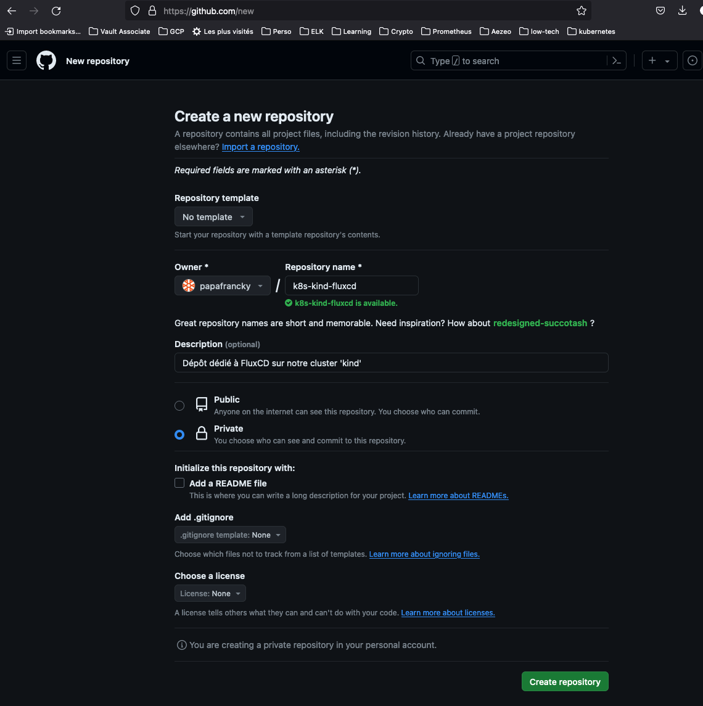

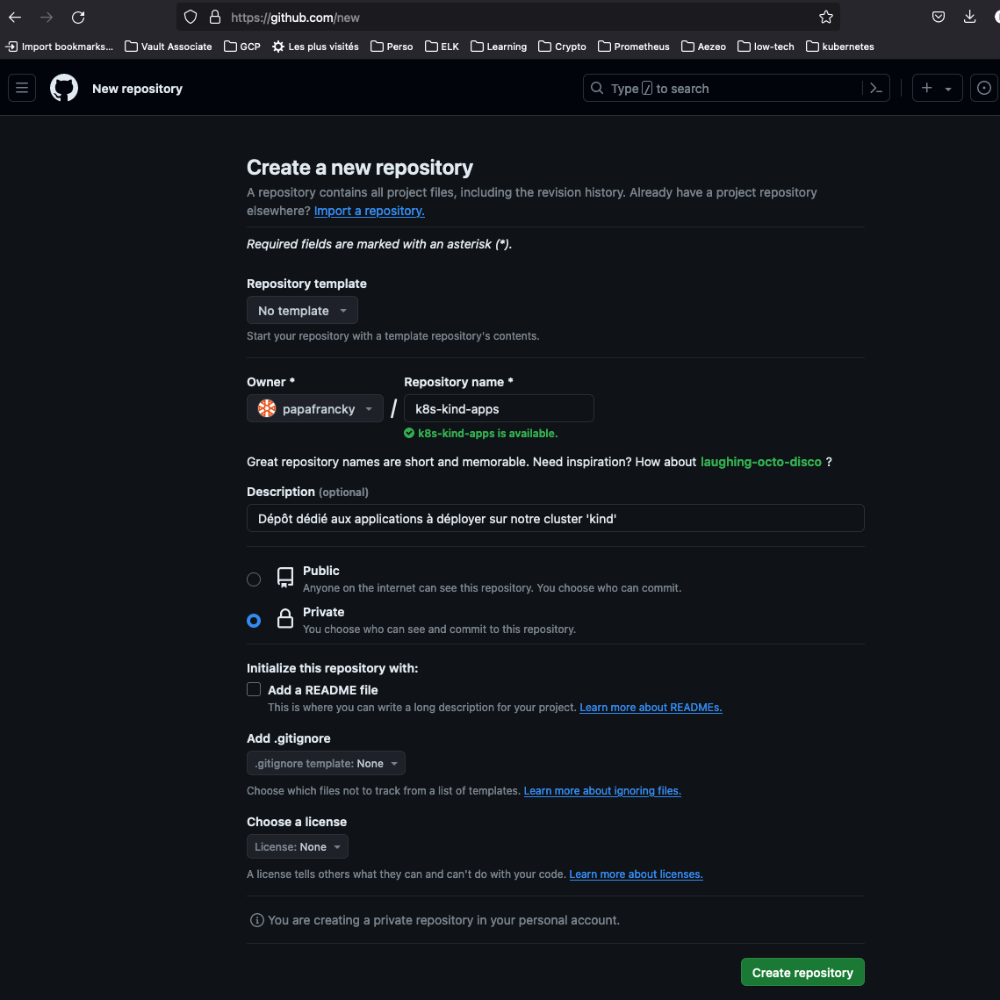


### Clonage des dépôts en local

Une fois les dépôts créés, nous les clonons sur notre laptop :

!!! note
    Nous clonerons tous nos dépôts dans le répertoire renseigné dans la variable __${LOCAL_GITHUB_REPOS}__.

```sh
export LOCAL_GITHUB_REPOS="${HOME}/code/github"

cd ${LOCAL_GITHUB_REPOS}
git clone git@github.com:papafrancky/k8s-kind-fluxcd.git
git clone git@github.com:papafrancky/k8s-kind-apps.git
```


----------------------------------------------------------------------------------------------------
## Bootstrap de FluxCD

Le projet Flux est composé d'un outil en ligne de commande (le FLux CLI) et d'une série de contrôleurs Kubernetes.

Pour installer Flux, vous devez d'abord télécharger le CLI de Flux. Ensuite, à l'aide de la CLI, vous pouvez déployer les contrôleurs Flux sur vos clusters et configurer votre premier pipeline de livraison GitOps.

La commande *'flux bootstrap github'* déploie les contrôleurs Flux sur un cluster Kubernetes et configure ces derniers pour synchroniser l'état du cluster à partir d'un dépôt GitHub. En plus d'installer les contrôleurs, la commande bootstrap pousse les manifestes de Flux vers le dépôt GitHub et configure Flux pour qu'il se mette à jour à partir de Git.

|Doc|Link|
|---|---|
|Install the Flux controllers|https://fluxcd.io/flux/installation/#install-the-flux-controllers|
|Flux bootstrap for GitHub|https://fluxcd.io/flux/installation/bootstrap/github/|
|GitHub default environment variables|https://docs.github.com/en/actions/learn-github-actions/variables#default-environment-variables|


=== "code"

    ```sh
    export GITHUB_USER=papaFrancky
    export GITHUB_TOKEN=<my_github_personal_access_token>
    export FLUXCD_GITHUB_REPO=k8s-kind-fluxcd
    
    flux bootstrap github \
      --token-auth \
      --owner ${GITHUB_USER} \
      --repository ${GITHUB_REPOSITORY} \
      --branch=main \
      --path=. \
      --personal \
      --components-extra=image-reflector-controller,image-automation-controller
    ```

=== "output"

    ```sh
    ► connecting to github.com
    ► cloning branch "main" from Git repository "https://github.com/papaFrancky/k8s-kind-fluxcd.git"
    ✔ cloned repository
    ► generating component manifests
    ✔ generated component manifests
    ✔ component manifests are up to date
    ► installing components in "flux-system" namespace
    ✔ installed components
    ✔ reconciled components
    ► determining if source secret "flux-system/flux-system" exists
    ► generating source secret
    ► applying source secret "flux-system/flux-system"
    ✔ reconciled source secret
    ► generating sync manifests
    ✔ generated sync manifests
    ✔ sync manifests are up to date
    ► applying sync manifests
    ✔ reconciled sync configuration
    ◎ waiting for Kustomization "flux-system/flux-system" to be reconciled
    ✔ Kustomization reconciled successfully
    ► confirming components are healthy
    ✔ helm-controller: deployment ready
    ✔ image-automation-controller: deployment ready
    ✔ image-reflector-controller: deployment ready
    ✔ kustomize-controller: deployment ready
    ✔ notification-controller: deployment ready
    ✔ source-controller: deployment ready
    ✔ all components are healthy
    ```

Vérifions dans les événements de FluxCD :

=== "code"

    ```sh
    flux events
    ```

=== "output"

    ```sh
    LAST SEEN          TYPE    REASON                  OBJECT                          MESSAGE
    15m                     Normal  NewArtifact             GitRepository/flux-system       stored artifact for commit 'Add Flux sync manifests'
    15m                     Normal  ReconciliationSucceeded Kustomization/flux-system       Reconciliation finished in 2.536346081s, next run in 10m0s
    15m                     Normal  Progressing             Kustomization/flux-system       CustomResourceDefinition/alerts.notification.toolkit.fluxcd.io configured
                                                                                            CustomResourceDefinition/buckets.source.toolkit.fluxcd.io configured
                                                                                            CustomResourceDefinition/gitrepositories.source.toolkit.fluxcd.io configured
                                                                                            CustomResourceDefinition/helmcharts.source.toolkit.fluxcd.io configured
                                                                                            CustomResourceDefinition/helmreleases.helm.toolkit.fluxcd.io configured
                                                                                            CustomResourceDefinition/helmrepositories.source.toolkit.fluxcd.io configured
                                                                                            CustomResourceDefinition/imagepolicies.image.toolkit.fluxcd.io configured
                                                                                            CustomResourceDefinition/imagerepositories.image.toolkit.fluxcd.io configured
                                                                                            CustomResourceDefinition/imageupdateautomations.image.toolkit.fluxcd.io configured
                                                                                            CustomResourceDefinition/kustomizations.kustomize.toolkit.fluxcd.io configured
                                                                                            CustomResourceDefinition/ocirepositories.source.toolkit.fluxcd.io configured
                                                                                            CustomResourceDefinition/providers.notification.toolkit.fluxcd.io configured
                                                                                            CustomResourceDefinition/receivers.notification.toolkit.fluxcd.io configured
                                                                                            Namespace/flux-system configured
                                                                                            ServiceAccount/flux-system/helm-controller configured
                                                                                            ServiceAccount/flux-system/image-automation-controller configured
                                                                                            ServiceAccount/flux-system/image-reflector-controller configured
                                                                                            ServiceAccount/flux-system/kustomize-controller configured
                                                                                            ServiceAccount/flux-system/notification-controller configured
                                                                                            ServiceAccount/flux-system/source-controller configured
                                                                                            ClusterRole/crd-controller-flux-system configured
                                                                                            ClusterRole/flux-edit-flux-system configured
                                                                                            ClusterRole/flux-view-flux-system configured
                                                                                            ClusterRoleBinding/cluster-reconciler-flux-system configured
                                                                                            ClusterRoleBinding/crd-controller-flux-system configured
                                                                                            Service/flux-system/notification-controller configured
                                                                                            Service/flux-system/source-controller configured
                                                                                            Service/flux-system/webhook-receiver configured
                                                                                            Deployment/flux-system/helm-controller configured
                                                                                            Deployment/flux-system/image-automation-controller configured
                                                                                            Deployment/flux-system/image-reflector-controller configured
                                                                                            Deployment/flux-system/kustomize-controller configured
                                                                                            Deployment/flux-system/notification-controller configured
                                                                                            Deployment/flux-system/source-controller configured
                                                                                            Kustomization/flux-system/flux-system configured
                                                                                            NetworkPolicy/flux-system/allow-egress configured
                                                                                            NetworkPolicy/flux-system/allow-scraping configured
                                                                                            NetworkPolicy/flux-system/allow-webhooks configured
                                                                                            GitRepository/flux-system/flux-system configured
    5m29s                   Normal  ReconciliationSucceeded Kustomization/flux-system       Reconciliation finished in 761.801712ms, next run in 10m0s
    22s (x15 over 14m)      Normal  GitOperationSucceeded   GitRepository/flux-system       no changes since last reconcilation: observed revision 'main@sha1:1258fc09abf6cd1bd639cd18ce4a2e9e4c1a7a9b'
    ```


Cherchons les objets créés dans le namespace de FluxCD :

=== "code"

    ```sh
    kubectl -n flux-system get all
    ```

=== "output"

    ```sh
    NAME                                               READY   STATUS    RESTARTS   AGE
    pod/helm-controller-57694fc9d6-pbl5c               1/1     Running   0          19m
    pod/image-automation-controller-5f7d999559-49fms   1/1     Running   0          19m
    pod/image-reflector-controller-58db7c9785-mjfh5    1/1     Running   0          19m
    pod/kustomize-controller-7f689848b9-k7hmd          1/1     Running   0          19m
    pod/notification-controller-6cffcffd7d-rkmwl       1/1     Running   0          19m
    pod/source-controller-7f95c446b6-b8gcd             1/1     Running   0          19m
    
    NAME                              TYPE        CLUSTER-IP     EXTERNAL-IP   PORT(S)   AGE
    service/notification-controller   ClusterIP   10.96.206.29   <none>        80/TCP    19m
    service/source-controller         ClusterIP   10.96.94.126   <none>        80/TCP    19m
    service/webhook-receiver          ClusterIP   10.96.125.18   <none>        80/TCP    19m
    
    NAME                                          READY   UP-TO-DATE   AVAILABLE   AGE
    deployment.apps/helm-controller               1/1     1            1           19m
    deployment.apps/image-automation-controller   1/1     1            1           19m
    deployment.apps/image-reflector-controller    1/1     1            1           19m
    deployment.apps/kustomize-controller          1/1     1            1           19m
    deployment.apps/notification-controller       1/1     1            1           19m
    deployment.apps/source-controller             1/1     1            1           19m
    
    NAME                                                     DESIRED   CURRENT   READY   AGE
    replicaset.apps/helm-controller-57694fc9d6               1         1         1       19m
    replicaset.apps/image-automation-controller-5f7d999559   1         1         1       19m
    replicaset.apps/image-reflector-controller-58db7c9785    1         1         1       19m
    replicaset.apps/kustomize-controller-7f689848b9          1         1         1       19m
    replicaset.apps/notification-controller-6cffcffd7d       1         1         1       19m
    replicaset.apps/source-controller-7f95c446b6             1         1         1       19m
    ```


----------------------------------------------------------------------------------------------------
## Gestion automatique des déploiements d'applications par FluxCD

FluxCD peut gérer l'automatisation du déploiement d'applications packagées avec Helm ou bien directement depuis un dépôt Git. Nous allons d'abord nous concentrer sur le déploiement d'applications depuis un dépôt Git (GitHub dans notre cas).

Pour illluster le fonctionnement de FluxCD, nous allons déployer 2 applications que nous exposerons par la suite avec notre Ingress Controller Nginx : foo & bar.
En réalité, ces deux applications sont strictement les mêmes, puisqu'elles consistent chacune en un pod utilisant la même image *'e2e-test-images/agnhost'*, mais nous considérerons qu'il s'agit bel et bien de 2 applications distinctes différentes.

``` mermaid

graph TD

A(users)
B(("ingress\n'foobar'"))
C{service\n'foo'}
D{service\n'bar'}
E[deployment\n'foo']
F[deployment\n'bar']

A -.-> B
B --> C & D

subgraph application 'foo'
C --> E
end

subgraph application 'bar'
D --> F
end
```

Chaque application sera hébergée dans son propre namespace.
Dans le dépôt GitHub dédié aux applications qui seront pilotées par FluxCD, nous créerons un répertoire pour chaque application 'foo' et bar' et y déposerons les manifests YAML qui définiront les services et déploiements pour chacune d'entre elles.

```sh title="${LOCAL_GITHUB_REPOS}/k8s-kins-apps"
k8s-kind-apps
├── bar
│   ├── bar.deployment.yaml
│   ├── bar.service.yaml
│   └── namespace.yaml
└── foo
    ├── foo.deployment.yaml
    ├── foo.service.yaml
    └── namespace.yaml
```


### Namespaces dédiés à l'application

=== "code"
    ```sh
    export LOCAL_GITHUB_REPOS="${HOME}/code/github"
    
    cd ${LOCAL_GITHUB_REPOS}/k8s-kind-fluxcd
    mkdir foo bar
        
    kubectl create namespace foo --dry-run=client -o yaml > foo/namespace.yaml
    kubectl create namespace bar --dry-run=client -o yaml > bar/namespace.yaml
    kubectl apply -f foo/namespace.yaml
    kubectl apply -f bar/namespace.yml

    git add .
    git commit -m "created namespace 'k8s-kind-apps'."
    git push
    ```

=== "foo namespace"
    ```sh
    apiVersion: v1
    kind: Namespace
    metadata:
      name: foo
    ```
=== "bar namespace"
    ```sh
    apiVersion: v1
    kind: Namespace
    metadata:
      name: bar
    ```


### Dépôt GitHub dédié aux applications

Les applications seront récupérées directement depuis un dépôt Git. Si elles avaient été packagées sous la forme d'une Helm Chart, GluxCD les aurait récupéré directement depuis un dépôt Helm.

Nous avons préalablement créé sur GitHub un dépôt dédié à l'hébergement de toutes les applications que FluxCD va gérer pour notre cluster : github.com/${GITHUB_USERNAME}/__k8s-kind-apps__.

Nous allons créer dans la copie locale (git clone) de ce dépôt sur notre poste de travail un sous-répertoire qui contiendra son application : 

```sh
export LOCAL_GITHUB_REPOS="${HOME}/code/github"

cd ${LOCAL_GITHUB_REPOS}/k8s-kind-apps
mkdir foo bar
```

Les applications 'foo' et 'bar' sont très simples, et sont composées d'un pod et d'un service en frontal :


=== "deployment: foo" 
    ```sh
    cat << EOF >> foo/deployment.yaml
    apiVersion: apps/v1
    kind: Deployment
    metadata:
      labels:
        app: foo
      name: foo
    spec:
      replicas: 1
      selector:
        matchLabels:
          app: foo
      template:
        metadata:
          labels:
            app: foo
        spec:
          containers:
          - name: agnhost
            image: registry.k8s.io/e2e-test-images/agnhost:2.39
            command:
            - /agnhost
            - netexec
            - --http-port
            - "8080"
    EOF
    ```

=== "service: foo"
    ```sh
    cat << EOF >> foo/service.yaml
    ---
    kind: Service
    apiVersion: v1
    metadata:
      name: foo
    spec:
      selector:
        app: foo
      ports:
      # Default port used by the image
      - port: 8080
        EOF
    ```

=== "deployment: bar"
    ```sh
    cat << EOF >> bar/deployment.yaml
    apiVersion: apps/v1
    kind: Deployment
    metadata:
      labels:
        app: bar
      name: bar
    spec:
      replicas: 1
      selector:
        matchLabels:
          app: bar
      template:
        metadata:
          labels:
            app: bar
        spec:
          containers:
          - name: agnhost
            image: registry.k8s.io/e2e-test-images/agnhost:2.39
            command:
            - /agnhost
            - netexec
            - --http-port
            - "8080"
    EOF
    ```

=== "service: bar"
    ```sh
    cat << EOF >> bar/service.yaml
     ---
    kind: Service
    apiVersion: v1
    metadata:
      name: bar
    spec:
      selector:
        app: bar
      ports:
      # Default port used by the image
      - port: 8080
        EOF
    ```


Nous avons décrit nos applications sous la forme de manifests YAML sur notre copie locale du dépôt dédié aux applications :

=== "code"
    ```sh
    export LOCAL_GITHUB_REPOS="${HOME}/code/github"

    tree ${LOCAL_GITHUB_REPOS}/k8s-kind-apps
    ```

=== "output"
    ```sh
    ${LOCAL_GITHUB_REPOS}/k8s-kind-apps
    ├── bar
    │   ├── deployment.yaml
    │   ├── namespace.yaml
    │   └── service.yaml
    └── foo
        ├── deployment.yaml
        ├── namespace.yaml
        └── service.yaml
    ```

Il ne nous reste plus qu'à pousser les modifications sur notre dépôt GitHub :

```sh
export LOCAL_GITHUB_REPOS="${HOME}/code/github"
cd ${LOCAL_GITHUB_REPOS}/k8s-kind-apps

git add .
git commit -m 'feat: added foobar app.'
git push
```

Les applications se trouvent désormais bien dans le dépôt GitHub dédié aux applications :

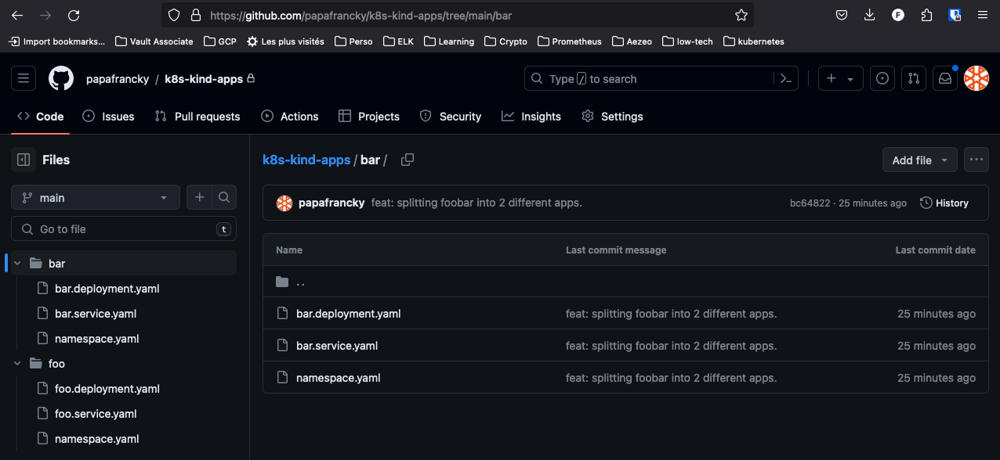

Nous allons pouvoir définir ces dépôts au niveau de FluxCd pour que ce dernier puisse les gérer.


---

### Définition des GitRepository de chacune de nos applications

Nous allons définir au niveau de FluxCD le dépôt GitHub de chacune des applications et lui permettre de s'y connecter avec les droits d'écriture. Dans notre cas, nous utilisons un même dépôt GitHub pour toutes nos applications. Nous pourrions nous contenter de ne définir qu'un seul GitRepository mais avons fait le choix de réduire tant que possible des adhéences éventuelles entre applications. En définissant un GitRepository par application, nous permettons ainsi la suppression de tous les objets Kubernetes liées à une application sans dépendances avec les autres objets des applications restantes. Il n'y a pas de bon ou de mauvais choix, c'est simplement le nôtre.


#### Deploy Keys

Pour permettre à FluxCD de se connecter aux dépôts GitHub des applications qu'il doit gérer, nous devons créer une paire de clés SSH et déployer la clé publique sur les dépôts concernés.

#### Création des *'Deploy Keys'*

Nous devons créer une paire de clés SSH pour permettre à FluxCD de se connecter avec les droits d'écriture au dépôt dédié à FluxCD. Nous en aurons besoin pour définir le *'GitRepository'*.
S'agissant de 'secrets', nous ne conserverons pas le manifest YAML dans le dépôt.

```sh
export GITHUB_USERNAME=papafrancky

flux create secret git k8s-kind-apps \
  --url=ssh://github.com/${GITHUB_USERNAME}/k8s-kind-apps \
  --namespace=foo
flux create secret git k8s-kind-apps \
  --url=ssh://github.com/${GITHUB_USERNAME}/k8s-kind-apps \
  --namespace=bar
```

Vérifions la bonne création du secret :

=== "code"
    ```sh
    kubectl -n foo get secret k8s-kind-apps -o yaml
    kubectl -n bar get secret k8s-kind-apps -o yaml
    ```

=== "foo secret"
    ```sh
    apiVersion: v1
    data:
      identity:     LS0tLS1CRUdJTiBQUklWQVRFIEtFWS0tLS0tCk1JRzJBZ0VBTUJBR0J5cUdTTTQ5QWdFR0JTdUJCQUFpQklHZU1JR2JBZ0VCQkRCWk1HVXAwNTJLT1BmbE85UU4KTlZBbzBzY3Y1bzlMTElUVzFieUorZTFaVlRNQWl1cXd0YkhHdDc3TlVzUUZ0T2FoWkFOaUFBU0JyWXhNOUxUcwp0Wmp1d2hkL0J5bVI3Sks4cy9zQk5zSEkwdGprMFQyRGg    1dlFOTkNaK1lEb2pEb0FBZk82bWN3NytOalV3cGd1CnlOTTNGb081Q3piSTJ0aEwzdHNmMjV2aWZ3blpobERNZDRiSGdCMUNKekJrWHBROUlRTnBQNmM9Ci0tLS0tRU5EIFBSSVZBVEUgS0VZLS0tLS0K
      identity.pub:     ZWNkc2Etc2hhMi1uaXN0cDM4NCBBQUFBRTJWalpITmhMWE5vWVRJdGJtbHpkSEF6T0RRQUFBQUlibWx6ZEhBek9EUUFBQUJoQklHdGpFejB0T3kxbU83Q0YzOEhLWkhza3J5eit3RTJ3Y2pTMk9UUlBZT0htOUEwMEpuNWdPaU1PZ0FCODdxWnpEdjQyTlRDbUM3STB6Y1dnN2tMTnNqYTJFdmUyeC9ibStKL0NkbUdVTXgzaHNlQUhVSW5NR1J    lbEQwaEEyay9wdz09Cg==
      known_hosts: Z2l0aHViLmNvbSBlY2RzYS1zaGEyLW5pc3RwMjU2IEFBQUFFMlZqWkhOaExYTm9ZVEl0Ym1semRIQXlOVFlBQUFBSWJtbHpkSEF5TlRZQUFBQkJCRW1LU0VOalFFZXpPbXhrWk15N29wS2d3RkI5bmt0NVlScllNak51RzVOODd1UmdnNkNMcmJvNXdBZFQveTZ2MG1LVjBVMncwV1oyWUIvKytUcG9ja2c9
    kind: Secret
    metadata:
      creationTimestamp: "2024-04-27T08:49:36Z"
      name: k8s-kind-apps
      namespace: foo
      resourceVersion: "1295276"
      uid: a319b96b-80a0-457a-aa33-0fc23ab7def6
    type: Opaque
    ```

=== "bar secret"
    ```sh
    apiVersion: v1
    data:
      identity:     LS0tLS1CRUdJTiBQUklWQVRFIEtFWS0tLS0tCk1JRzJBZ0VBTUJBR0J5cUdTTTQ5QWdFR0JTdUJCQUFpQklHZU1JR2JBZ0VCQkRDcVRkUlpaK1BuWjRYYWRCelMKb2hoQjdjMVBVNEh5OVYzeXp6dTFJdU9HMlFVd09vMUtBN0I3M0dweGJaUUI2K2VoWkFOaUFBUnA5UmFwaFMzTgpPaVRsTzZ2TEdQSG0va2NHR2YzYzk0eHpRR041Q0ltV1V    WS0xlQi9NajdGK1d0RzEyVmZ3QVRGaTFoclhkVUg4CkxWQ29JUjJoeUp3Y251R2dZaEYrc3pTanBuSDA1dVpuVm5ibXhUZmlleWkxNUNibGpOOGVrQnM9Ci0tLS0tRU5EIFBSSVZBVEUgS0VZLS0tLS0K
      identity.pub:     ZWNkc2Etc2hhMi1uaXN0cDM4NCBBQUFBRTJWalpITmhMWE5vWVRJdGJtbHpkSEF6T0RRQUFBQUlibWx6ZEhBek9EUUFBQUJoQkduMUZxbUZMYzA2Sk9VN3E4c1k4ZWIrUndZWi9kejNqSE5BWTNrSWlaWlJVb3Q0SDh5UHNYNWEwYlhaVi9BQk1XTFdHdGQxUWZ3dFVLZ2hIYUhJbkJ5ZTRhQmlFWDZ6TktPbWNmVG01bWRXZHViRk4rSjdLTFh    rSnVXTTN4NlFHdz09Cg==
      known_hosts: Z2l0aHViLmNvbSBlY2RzYS1zaGEyLW5pc3RwMjU2IEFBQUFFMlZqWkhOaExYTm9ZVEl0Ym1semRIQXlOVFlBQUFBSWJtbHpkSEF5TlRZQUFBQkJCRW1LU0VOalFFZXpPbXhrWk15N29wS2d3RkI5bmt0NVlScllNak51RzVOODd1UmdnNkNMcmJvNXdBZFQveTZ2MG1LVjBVMncwV1oyWUIvKytUcG9ja2c9
    kind: Secret
    metadata:
      creationTimestamp: "2024-04-27T08:50:31Z"
      name: k8s-kind-apps
      namespace: bar
      resourceVersion: "1295422"
      uid: eaab7311-c1f1-4579-8157-0a2d131f9e2b
    type: Opaque
    ```


#### Ajout de la clé publique sur le dépôt GitHub

Les clés publiques doivent être extraites des 'secrets' et renseignées dans les paramètres du dépôt GitHub  _*k8s-kind-fluxcd*_.

=== "code"
    ```sh
    kubectl -n foo get secret k8s-kind-apps -o jsonpath='{.data.identity\.pub}' | base64 -d
    kubectl -n bar get secret k8s-kind-apps -o jsonpath='{.data.identity\.pub}' | base64 -d
    ```

=== "foo public key"
    '''sh
    ecdsa-sha2-nistp384 AAAAE2VjZHNhLXNoYTItbmlzdHAzODQAAAAIbmlzdHAzODQAAABhBIGtjEz0tOy1mO7CF38HKZHskryz+wE2wcjS2OTRPYOHm9A00Jn5gOiMOgAB87qZzDv42NTCmC7I0zcWg7kLNsja2Eve2x/bm+J/CdmGUMx3hseAHUInMGRelD0hA2k/pw==
    '''

=== "bar public key"
    '''sh
    ecdsa-sha2-nistp384 AAAAE2VjZHNhLXNoYTItbmlzdHAzODQAAAAIbmlzdHAzODQAAABhBGn1FqmFLc06JOU7q8sY8eb+RwYZ/dz3jHNAY3kIiZZRUot4H8yPsX5a0bXZV/ABMWLWGtd1QfwtUKghHaHInBye4aBiEX6zNKOmcfTm5mdWdubFN+J7KLXkJuWM3x6QGw==
    '''

Une fois sur la page de dépôt, cliquer sur le bouton _*Settings*_, puis dans la colonne de gauche sur la page suivante, sur le line _*Deploy Keys*_ dans la partie 'Security' :

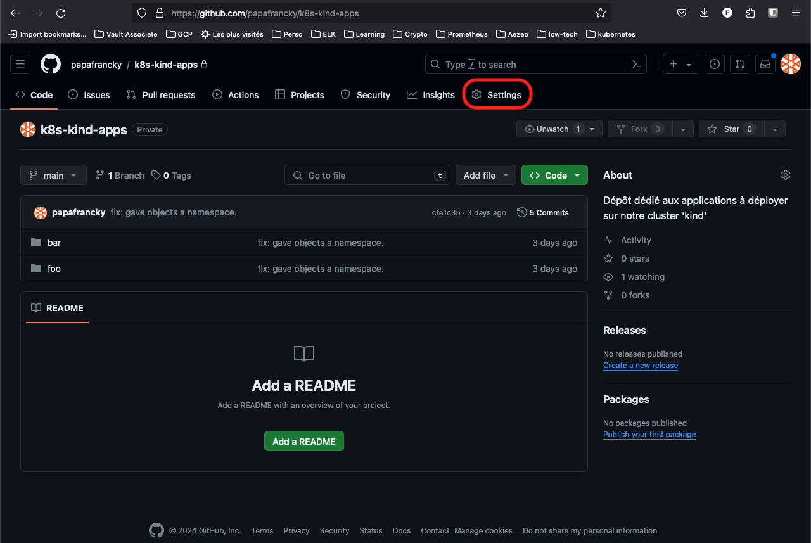

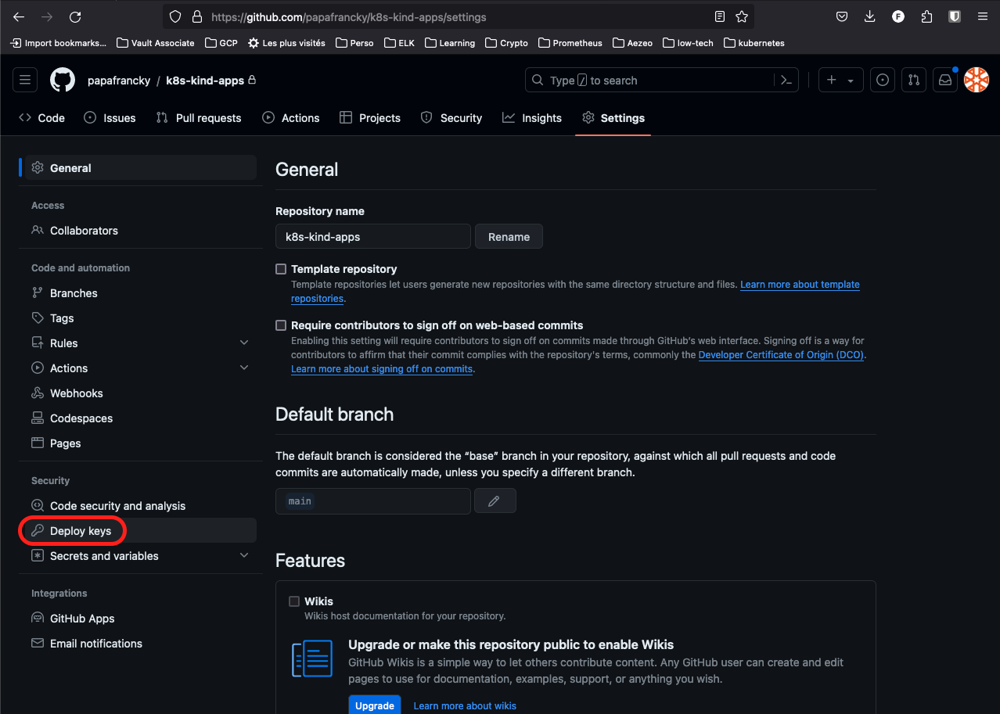

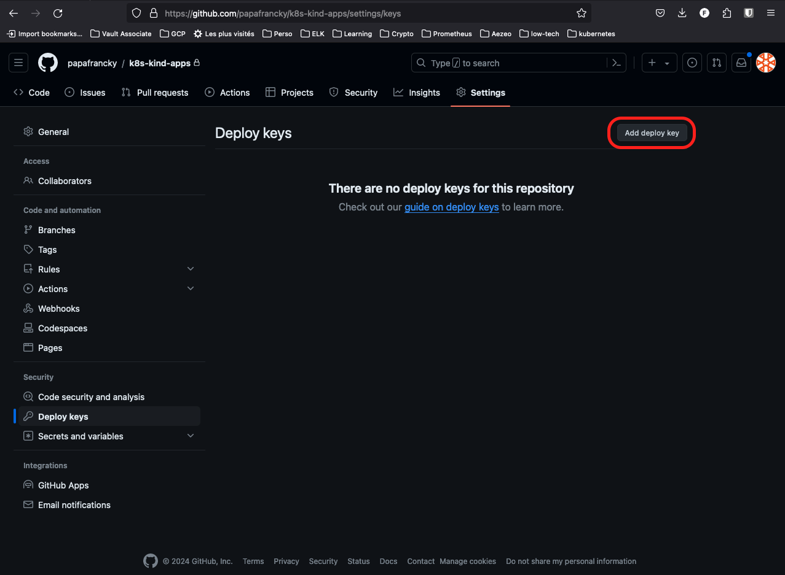

!!! warning
    La case __'Allow write access'__ doit être cochée pour permettre à FluxCD d'apporter des modifications dans son dépôt !

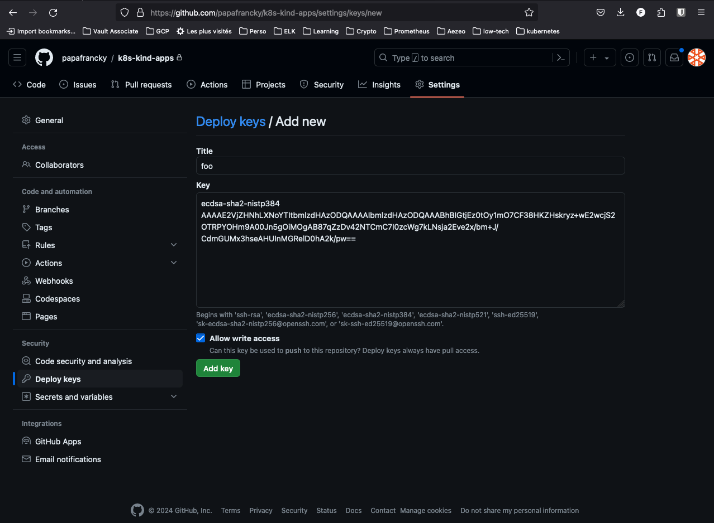

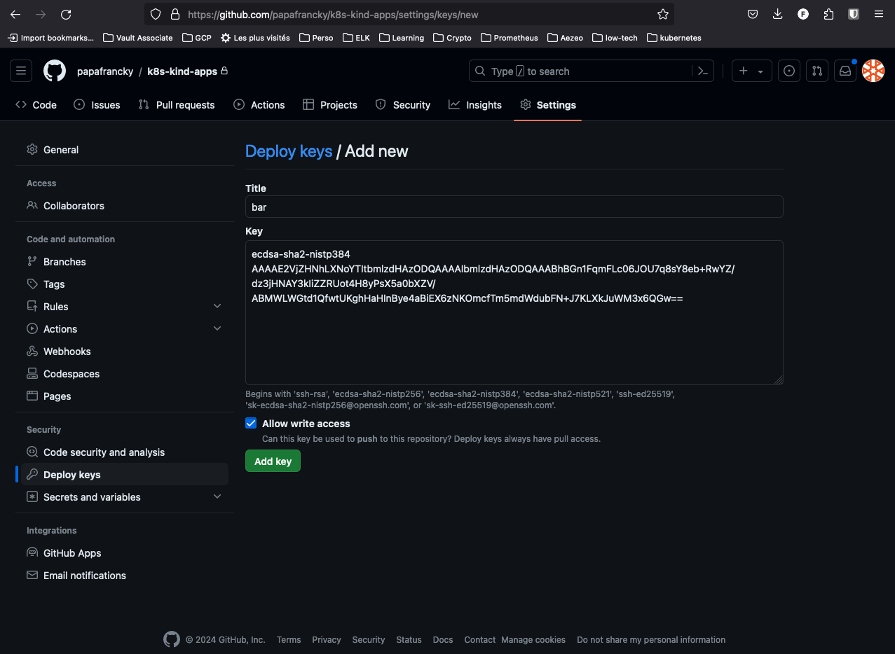

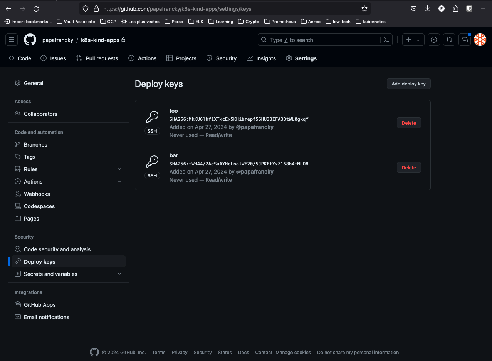


#### Définition du GitRepository *"k8s-kind-apps"* pour chacune des applications

L'API GitRepository définit une source pour produire un artefact pour une révision d'un dépôt Git.

!!! info
    https://fluxcd.io/flux/components/source/gitrepositories/

Voici les informations qu'il faudra donner pour définir un 'GitRepository' :

* Le nom que nous souhaitons lui donner : *k8s-kind-fluxcd*;
* L'URL du dépôt GitHub : *ssh://git@github.com/${GITHUB_USERNAME}/k8s-kind-fluxcd.git*;
* La branche du dépôt d'où récupérer le code : *main*;
* Le secret d'où extraire la clé privée pour se connecter au dépôt GitHub : *foo* ou *bar* selon l'application concernée.


```sh 
   export LOCAL_GITHUB_REPOS="${HOME}/code/github"
   export GITHUB_USERNAME=papafrancky

   cd ${LOCAL_GITHUB_REPOS}/k8s-kind-fluxcd
   mkdir -p apps/foo apps/bar
```

=== "code"
    ```sh
    flux create source git k8s-kind-apps \
      --url=ssh://git@github.com/${GITHUB_USERNAME}/k8s-kind-apps.git \
      --branch=main \
      --secret-ref=k8s-kind-apps \
      --namespace=foo \
      --export > apps/foo/gitrepository.yaml
    
    flux create source git k8s-kind-apps \
      --url=ssh://git@github.com/${GITHUB_USERNAME}/k8s-kind-apps.git \
      --branch=main \
      --secret-ref=k8s-kind-apps \
      --namespace=bar \
      --export > apps/bar/gitrepository.yaml
    ```
   
=== "'foo' GitRepository"
    ```sh
    ---
    apiVersion: source.toolkit.fluxcd.io/v1beta2
    kind: GitRepository
    metadata:
      name: k8s-kind-apps
      namespace: foo
    spec:
      interval: 1m0s
      ref:
        branch: main
      secretRef:
        name: k8s-kind-apps
      url: ssh://git@github.com/papafrancky/k8s-kind-apps.git
    ```

=== "'bar' GitRepository"
    ```
    ---
    apiVersion: source.toolkit.fluxcd.io/v1beta2
    kind: GitRepository
    metadata:
      name: k8s-kind-apps
      namespace: bar
    spec:
      interval: 1m0s
      ref:
        branch: main
      secretRef:
        name: k8s-kind-apps
      url: ssh://git@github.com/papafrancky/k8s-kind-apps.git
    ```


#### Définition des *'Kustomizations'* pour chacun des GitRepositories

!!! tip
    Nommer le manifest 'kustomize.yml' pose des problèmes, le nom doit être réservé pour les besoins internes de Flux. Nous le nommerons 'sync.yaml'.

=== "code"
    ```sh
    export LOCAL_GITHUB_REPOS="${HOME}/code/github"
    cd ${LOCAL_GITHUB_REPOS}/k8s-kind-fluxcd
    
    flux create kustomization foo \
        --source=GitRepository/k8s-kind-apps.foo \
        --path="./foo" \
        --prune=true \
        --namespace=foo \
        --export > apps/foo/sync.yaml

    flux create kustomization bar \
        --source=GitRepository/k8s-kind-apps.bar \
        --path="./bar" \
        --prune=true \
        --namespace=bar \
        --export > apps/bar/sync.yaml
    ```

=== "'foo' kustomization"
    ```sh
    ---
    apiVersion: kustomize.toolkit.fluxcd.io/v1beta2
    kind: Kustomization
    metadata:
      name: foo
      namespace: foo
    spec:
      interval: 1m0s
      path: ./foo
      prune: true
      sourceRef:
        kind: GitRepository
        name: k8s-kind-apps
        namespace: foo
    ```

=== "'bar' kustomization"
    ```sh
    ---
    apiVersion: kustomize.toolkit.fluxcd.io/v1beta2
    kind: Kustomization
    metadata:
      name: bar
      namespace: bar
    spec:
      interval: 1m0s
      path: ./bar
      prune: true
      sourceRef:
        kind: GitRepository
        name: k8s-kind-apps
        namespace: bar
    ```


Il est temps de pousser nos modifications dans le dépôt GitHub :

```sh
   export LOCAL_GITHUB_REPOS="${HOME}/code/github"
   cd ${LOCAL_GITHUB_REPOS}/k8s-kind-fluxcd

   git status
   git add .
   git commit -m "feat: added GitRepositories and Kustomizations for 'foo' and 'bar' apps."
   git push
```

Forçons la réconciliation :

=== "code"
    ```sh
    flux reconcile kustomization flux-system --with-source
    ```

=== "output"
    ```sh
    ► annotating GitRepository flux-system in flux-system namespace
    ✔ GitRepository annotated
    ◎ waiting for GitRepository reconciliation
    ✔ fetched revision main@sha1:f9875e137abb0d4f810b4042fa98713adaca2701
    ► annotating Kustomization flux-system in flux-system namespace
    ✔ Kustomization annotated
    ◎ waiting for Kustomization reconciliation
    ✔ applied revision main@sha1:f9875e137abb0d4f810b4042fa98713adaca2701
    ```

Nous devrions désormais voir le GitRepository défini au niveau du cluster :

=== "code"
    ```
    k -n foo get gitrepository k8s-kind-apps
    k -n bar get gitrepository k8s-kind-apps
    ```

=== "output "
    ```
    NAME            URL                                                  AGE     READY   STATUS
    k8s-kind-apps   ssh://git@github.com/papafrancky/k8s-kind-apps.git   2m11s   True    stored artifact for revision 'main@sha1:cfe1c35724883dce2eaf428f144faeb3da27873b'
        
    NAME            URL                                                  AGE     READY   STATUS
    k8s-kind-apps   ssh://git@github.com/papafrancky/k8s-kind-apps.git   2m28s   True    stored artifact for revision 'main@sha1:cfe1c35724883dce2eaf428f144faeb3da27873b'
    ```

Surtout, nous devrions voir nos applications 'foo' et 'bar' déployées sur le cluster :

=== "code"
    ```sh
    kubectl -n foo get services,deployments,pods
    kubectl -n bar get services,deployments,pods
    ```

=== "foo output"
    ```sh
    NAME          TYPE        CLUSTER-IP     EXTERNAL-IP   PORT(S)    AGE
    service/foo   ClusterIP   10.96.81.216   <none>        8080/TCP   3m30s
    
    NAME                  READY   UP-TO-DATE   AVAILABLE   AGE
    deployment.apps/foo   1/1     1            1           3m30s
    
    NAME                       READY   STATUS    RESTARTS   AGE
    pod/foo-6f6cb79d96-bdjpq   1/1     Running   0          3m30s
    ```

=== "bar output"
    ```sh
    NAME          TYPE        CLUSTER-IP    EXTERNAL-IP   PORT(S)    AGE
    service/bar   ClusterIP   10.96.43.89   <none>        8080/TCP   4m53s
    
    NAME                  READY   UP-TO-DATE   AVAILABLE   AGE
    deployment.apps/bar   1/1     1            1           4m53s
    
    NAME                       READY   STATUS    RESTARTS   AGE
    pod/bar-764bd8d889-8wqq2   1/1     Running   0          4m53s
    ```


### ImageRepository

Nos deux applications _*'foo'*_ et _*'bar'*_ utilisent une même image Docker ("__e2e-test-images/agnhost__") et nous aimerions qu'elle soit mise à jour automatiquement si une nouvelle version venait à être publiée.
La mise en place d'un tel process d'automatisation nécessite la définition préalable d'un __'ImageRepository'__ auquel nous associerons une __'ImagePolicy'__.

=== "code"
    ```sh
    export LOCAL_GITHUB_REPOS="${HOME}/code/github"
    export GITHUB_USERNAME=papafrancky
    
    cd ${LOCAL_GITHUB_REPOS}/k8s-kind-fluxcd
    
    flux create image repository agnhost \
      --image=registry.k8s.io/e2e-test-images/agnhost \
      --interval=5m \
      --namespace=foo \
      --export > apps/foo/agnhost.imagerepository.yaml

    flux create image repository agnhost \
      --image=registry.k8s.io/e2e-test-images/agnhost \
      --interval=5m \
      --namespace=bar \
      --export > apps/bar/agnhost.imagerepository.yaml

    git add .
    git commit -m "feat: added image repository for foo and bar apps."
    git push
    ```

=== "'foo' ImagePolicy"
    ```sh
    ---
    apiVersion: image.toolkit.fluxcd.io/v1beta2
    kind: ImageRepository
    metadata:
      name: agnhost
      namespace: foo
    spec:
      image: registry.k8s.io/e2e-test-images/agnhost
      interval: 5m0s
    ```

=== "'bar' ImagePolicy"
    ```sh
    ---
    apiVersion: image.toolkit.fluxcd.io/v1beta2
    kind: ImageRepository
    metadata:
      name: agnhost
      namespace: bar
    spec:
      image: registry.k8s.io/e2e-test-images/agnhost
      interval: 5m0s
    ```

Vérifions la bonne création des *'ImagePolicies'*:

=== "code"
    ```sh
    kubectl -n foo get imagerepository agnhost -o yaml
    kubectl -n bar get imagerepository agnhost -o yaml
    ```

=== "foo ImageRepository"
    ```sh
    apiVersion: image.toolkit.fluxcd.io/v1beta2
    kind: ImageRepository
    metadata:
      creationTimestamp: "2024-04-27T09:52:39Z"
      finalizers:
      - finalizers.fluxcd.io
      generation: 1
      labels:
        kustomize.toolkit.fluxcd.io/name: flux-system
        kustomize.toolkit.fluxcd.io/namespace: flux-system
      name: agnhost
      namespace: foo
      resourceVersion: "1305975"
      uid: d078ca2e-f277-4d29-bdd3-ef140d6e34a8
    spec:
      exclusionList:
      - ^.*\.sig$
      image: registry.k8s.io/e2e-test-images/agnhost
      interval: 5m0s
      provider: generic
    status:
      canonicalImageName: registry.k8s.io/e2e-test-images/agnhost
      conditions:
      - lastTransitionTime: "2024-04-27T09:52:39Z"
        message: 'successful scan: found 27 tags'
        observedGeneration: 1
        reason: Succeeded
        status: "True"
        type: Ready
      lastScanResult:
        latestTags:
        - "2.9"
        - "2.51"
        - "2.50"
        - "2.48"
        - "2.47"
        - "2.45"
        - "2.44"
        - "2.43"
        - "2.41"
        - "2.40"
        scanTime: "2024-04-27T09:52:39Z"
        tagCount: 27
      observedExclusionList:
      - ^.*\.sig$
      observedGeneration: 1
    ```

=== "bar ImageRepository"
    ```sh
    apiVersion: image.toolkit.fluxcd.io/v1beta2
    kind: ImageRepository
    metadata:
      creationTimestamp: "2024-04-27T09:52:38Z"
      finalizers:
      - finalizers.fluxcd.io
      generation: 1
      labels:
        kustomize.toolkit.fluxcd.io/name: flux-system
        kustomize.toolkit.fluxcd.io/namespace: flux-system
      name: agnhost
      namespace: bar
      resourceVersion: "1305978"
      uid: 57f01130-5ef2-42e2-be24-5509c5232898
    spec:
      exclusionList:
      - ^.*\.sig$
      image: registry.k8s.io/e2e-test-images/agnhost
      interval: 5m0s
      provider: generic
    status:
      canonicalImageName: registry.k8s.io/e2e-test-images/agnhost
      conditions:
      - lastTransitionTime: "2024-04-27T09:52:39Z"
        message: 'successful scan: found 27 tags'
        observedGeneration: 1
        reason: Succeeded
        status: "True"
        type: Ready
      lastScanResult:
        latestTags:
        - "2.9"
        - "2.51"
        - "2.50"
        - "2.48"
        - "2.47"
        - "2.45"
        - "2.44"
        - "2.43"
        - "2.41"
        - "2.40"
        scanTime: "2024-04-27T09:52:39Z"
        tagCount: 27
      observedExclusionList:
      - ^.*\.sig$
      observedGeneration: 1
    ```

Nous pouvons d'ores et déjà constater que nous n'utilisons pas la version la plus récente de l'image __*'e2e-test-images/agnhost'*__.


### ImagePolicy

* nous utilisons la version __2.39__ :

=== "code"
    ```sh
    kubectl -n foo get deployment foo -o jsonpath='{.spec.template.spec.containers[].image}'
    ```

=== "output"
    ```sh
    registry.k8s.io/e2e-test-images/agnhost:2.39
    ```

* la version la plus récente est la __2.51__ :

=== "code"
    ```sh
    kubectl -n foo get imagerepository agnhost -o jsonpath='{.status.lastScanResult.latestTags}' | jq -r '.'
    ```

=== "output"
    ```sh
    [
      "2.9",
      "2.51",
      "2.50",
      "2.48",
      "2.47",
      "2.45",
      "2.44",
      "2.43",
      "2.41",
      "2.40"
    ]
    ```

Imaginons que nous souhaitions disposer de l'image 2.4.x la plus récente. Nous pouvons demander à FluxCD de gérer ces mises à jour automatiquement en définissant une __*'ImagePolicy'*__ distincte pour les __*'ImageRepository'*__ *'agnhost'* de nos applications *'foo'* et *'bar'*.

!!! note
    https://github.com/Masterminds/semver#checking-version-constraints

!!! warning
    Les images dans le dépôt ne sont suivent pas le versionnement 'SemVer'. Nous devons ici jouer avec une expression régulière et un tri croissant pour arriver à nos fins.

=== "code"
    ```
    export LOCAL_GITHUB_REPOS="${HOME}/code/github"
    export GITHUB_USERNAME=papafrancky
    
    cd ${LOCAL_GITHUB_REPOS}/k8s-kind-fluxcd
    
    flux create image policy agnhost \
      --image-ref=agnhost \
      --namespace=foo \
      --select-numeric asc \
      --filter-regex='\d\.\d' \
      --export > apps/foo/agnhost.imagepolicy.yaml
    
    flux create image policy agnhost \
    --image-ref=agnhost \
    --namespace=bar \
    --select-numeric asc \
    --filter-regex='\d\.\d' \
    --export > apps/bar/agnhost.imagepolicy.yaml

    git add .
    git commit -m "feat: defined an image policy for foo and bar apps."
    git push

    flux reconcile kustomization flux-system --with-source
    ```

=== "foo ImagePolicy"
    ```sh
    ---
    apiVersion: image.toolkit.fluxcd.io/v1beta2
    kind: ImagePolicy
    metadata:
      name: agnhost
      namespace: foo
    spec:
      imageRepositoryRef:
        name: agnhost
      filterTags:
        pattern: '\d\.\d\d'
        extract: ""
      policy:
        numerical:
          order: asc
    ```

=== "bar ImagePolicy"
    ```sh
    ---
    apiVersion: image.toolkit.fluxcd.io/v1beta2
    kind: ImagePolicy
    metadata:
      name: agnhost
      namespace: bar
    spec:
      imageRepositoryRef:
        name: agnhost
      filterTags:
        pattern: '\d\.\d\d'
        extract: ""
      policy:
        numerical:
          order: asc
    ```

Vérifions la bonne création des Image Policies :

=== "code"
    ```sh
    kubectl get ImagePolicy -A
    ```

=== "output"
    ```sh
    NAMESPACE   NAME      LATESTIMAGE
    bar         agnhost   registry.k8s.io/e2e-test-images/agnhost:2.51
    foo         agnhost   registry.k8s.io/e2e-test-images/agnhost:2.51
    ```


### Marquage des manifests de déploiement de de 'foo' et 'bar'

Nous devons maintenant indiquer à FluxCD où mettre la version de l'image à jour dans les manifests de l'application 'foobar'.
En effet, si FluxCD est capable de détecter une nouvelle version de l'image conforme à notre politique de mise à jour (dans notre cas, toutes les versions 2.x), il doit aussi mettre le code de déploiement de l'application.

Dans le cas de nos applications, l'image Docker et sa version sont définis dans les manifests qui décrivent les *'deployments'* : 

* ${LOCAL_GITHUB_REPOS}/k8s-kind-apps/foo/__deployment.yaml__;
* ${LOCAL_GITHUB_REPOS}/k8s-kind-apps/bar/__deployment.yaml__.


Ajoutons un marqueur pour permettre à FluxCD de mettre la version de l'image à jour :

=== "code"
    ```sh
    export LOCAL_GITHUB_REPOS="${HOME}/code/github"
    export GITHUB_USERNAME=papafrancky
    
    cd ${LOCAL_GITHUB_REPOS}/k8s-kind-apps
    
    gsed -i 's/agnhost:2\.39/agnhost:2\.39 # {"$imagepolicy": "foo:agnhost"}/' foo/deployment.yaml
    gsed -i 's/agnhost:2\.39/agnhost:2\.39 # {"$imagepolicy": "bar:agnhost"}/' bar/deployment.yaml
    
    git add .
    git commit -m "feat: added a marker on foobar's pods manifests."
    git push

    flux reconcile kustomization flux-system --with-source
    ```   

!!! info "Configure image update for custom resources"
    https://fluxcd.io/flux/guides/image-update/#configure-image-update-for-custom-resources


Le format du marqueur de l'image policy est le suivant :
```sh
* {"$imagepolicy": "<policy-namespace>:<policy-name>"}
* {"$imagepolicy": "<policy-namespace>:<policy-name>:tag"}
* {"$imagepolicy": "<policy-namespace>:<policy-name>:name"}
```


=== "'foo' deployment.yaml"
    ```sh
    apiVersion: apps/v1
    kind: Deployment
    metadata:
      name: foo
      namespace: foo
      labels:
        app: foo
    spec:
      replicas: 1
      selector:
        matchLabels:
          app: foo
      template:
        metadata:
          labels:
            app: foo
        spec:
          containers:
          - name: agnhost
            image: registry.k8s.io/e2e-test-images/agnhost:2.39 # {"$imagepolicy": "foobar:foobar"}
            command:
            - /agnhost
            - netexec
            - --http-port
            - "8080"
    ```

=== "'bar' deployment.yaml"
    ```sh
    apiVersion: apps/v1
    kind: Deployment
    metadata:
      name: bar
      namespace: bar
      labels:
        app: bar
    spec:
      replicas: 1
      selector:
        matchLabels:
          app: bar
      template:
        metadata:
          labels:
            app: bar
        spec:
          containers:
          - name: agnhost
            image: registry.k8s.io/e2e-test-images/agnhost:2.39 # {"$imagepolicy": "foobar:foobar"}
            command:
            - /agnhost
            - netexec
            - --http-port
            - "8080"
    ```


### Image Update Automation

Il ne nous reste plus qu'à tout mettre en musique en créant une 'ImageUpdateAutomation' pour chacune de nos applications.


!!! info "flux create image update"
    https://fluxcd.io/flux/cmd/flux_create_image_update/#examples

=== "code"
    ```sh
    export LOCAL_GITHUB_REPOS="${HOME}/code/github"

    cd ${LOCAL_GITHUB_REPOS}/k8s-kind-fluxcd

    flux create image update agnhost \
        --namespace=foo \
        --git-repo-ref=k8s-kind-apps \
        --git-repo-path="./foo" \
        --checkout-branch=main \
        --author-name=FluxCD \
        --author-email=19983231-papafrancky@users.noreply.github.com \
        --commit-template="{{range .Updated.Images}}{{println .}}{{end}}" \
        --export > apps/foo/imageupdateautomation.yaml
    
    flux create image update agnhost \
        --namespace=bar \
        --git-repo-ref=k8s-kind-apps \
        --git-repo-path="./bar" \
        --checkout-branch=main \
        --author-name=FluxCD \
        --author-email=19983231-papafrancky@users.noreply.github.com \
        --commit-template="{{range .Updated.Images}}{{println .}}{{end}}" \
        --export > apps/bar/imageupdateautomation.yaml
    
    git add .
    git commit -m "feat: added ImageUpdateAutomations to foo and bar applications respectively."
    git push

    flux reconcile kustomization flux-system --with-source
    ```

=== "'foo' ImageUpdateAutomation"
    ```sh
    ---
    apiVersion: image.toolkit.fluxcd.io/v1beta1
    kind: ImageUpdateAutomation
    metadata:
      name: agnhost
      namespace: foo
    spec:
      git:
        checkout:
          ref:
            branch: main
        commit:
          author:
            email: 19983231-papafrancky@users.noreply.github.com
            name: FluxCD
          messageTemplate: '{{range .Updated.Images}}{{println .}}{{end}}'
      interval: 1m0s
      sourceRef:
        kind: GitRepository
        name: k8s-kind-apps
      update:
        path: ./foo
        strategy: Setters
    ```

=== "'bar' ImageUpdateAutomation"
    ```sh
    ---
    apiVersion: image.toolkit.fluxcd.io/v1beta1
    kind: ImageUpdateAutomation
    metadata:
      name: agnhost
      namespace: bar
    spec:
      git:
        checkout:
          ref:
            branch: main
        commit:
          author:
            email: 19983231-papafrancky@users.noreply.github.com
            name: FluxCD
          messageTemplate: '{{range .Updated.Images}}{{println .}}{{end}}'
      interval: 1m0s
      sourceRef:
        kind: GitRepository
        name: k8s-kind-apps
      update:
        path: ./bar
        strategy: Setters
    ```


!!! note "Définir son adresse email de commit"
    https://docs.github.com/en/account-and-profile/setting-up-and-managing-your-personal-account-on-github/managing-email-preferences/setting-your-commit-email-address#about-commit-email-addresses

!!! note "Comment récupérer l'ID de son compte GitHub"
    https://api.github.com/users/${GITHUB_USERNAME}


Surveillons la mise à jour des images :

```sh
kubectl get pods --all-namespaces -l 'app in (foo, bar)'  -w
```


Vérifions la version des images utilisées :

=== "code"
    ```sh
    kubectl get pod --all-namespaces -l 'app in (foo, bar)' -o jsonpath='{.items[*].spec.containers[*].image}'
    ```

=== "avant"
    ```sh
    registry.k8s.io/e2e-test-images/agnhost:2.39 registry.k8s.io/e2e-test-images/agnhost:2.39%
    ```

=== "après"
    ```
    registry.k8s.io/e2e-test-images/agnhost:2.51 registry.k8s.io/e2e-test-images/agnhost:2.51%
    ```

Enfin, assurons-nous que FluxCD ait bien pu modifier le _*deployment*_ des applications pour prendre la version de l'image la plus récente en compte :

!!! warning
    Nous devons mettre à jour notre copie locale du dépôt des applications pour constater la boone réécriture de FluxCD.

=== "code"
    ```sh
       export LOCAL_GITHUB_REPOS="${HOME}/code/github"
    
       cd ${LOCAL_GITHUB_REPOS}/k8s-kind-apps
       git fetch
       git pull

       cat */deployment.yaml | grep image
    ```

=== "output"
    ```sh
    Mise à jour 17cb1e2..0925cae
    Fast-forward
     bar/deployment.yaml | 2 +-
     foo/deployment.yaml | 2 +-
     2 files changed, 2 insertions(+), 2 deletions(-)
    ```

Les manifests ont bien été modifiés.
Vérifions la mise à jour de la version des images :

=== "code"
    ```sh
    cat */deployment.yaml | grep image
    ```

=== "output"
    ```sh
    image: registry.k8s.io/e2e-test-images/agnhost:2.51 # {"$imagepolicy": "bar:agnhost"}
    image: registry.k8s.io/e2e-test-images/agnhost:2.51 # {"$imagepolicy": "foo:agnhost"}
    ```

Les images sont passées de la version initiale (2.39) à la version la plus récente conforme à l'ImagePolicy (2.51).

Tout fonctionne comme attendu ! :fontawesome-regular-face-laugh-wink:


----------------------------------------------------------------------------------------------------
### Exposition des applications

L'exposition des applications hébergées sur le cluster doit être gérée en dehors des applications. Nous allons définir les règles de routage de notre Ingress controller Nginx dans le dépôt GitHub dédié à FluxCD :

!!! note
    Bien que le contrôleur Ingress puisse être déployé dans n'importe quel namespace, il est généralement déployé dans un namespace distinct de vos services d'application (par exemple, ingress ou kube-system). Il peut voir les règles Ingress dans tous les autres espaces de noms et les récupérer. Cependant, chaque règle Ingress doit résider dans l'espace de noms où réside l'application qu'elle configure.

```sh
export LOCAL_GITHUB_REPOS="${HOME}/code/github"
    
cd ${LOCAL_GITHUB_REPOS}/k8s-kind-fluxcd

cat << EOF >> apps/foo/ingress.yaml
---
apiVersion: networking.k8s.io/v1
kind: Ingress
metadata:
  name: foo
  namespace: foo
  annotations:
    nginx.ingress.kubernetes.io/rewrite-target: /$2
spec:
  rules:
  - http:
      paths:
      - pathType: Prefix
        path: /foo(/|$)(.*)
        backend:
          service:
            name: foo
            port:
              number: 8080
EOF

cat << EOF >> apps/bar/ingress.yaml
---
apiVersion: networking.k8s.io/v1
kind: Ingress
metadata:
  name: bar
  namespace: bar
  annotations:
    nginx.ingress.kubernetes.io/rewrite-target: /$2
spec:
  rules:
  - http:
      paths:
      - pathType: Prefix
        path: /bar(/|$)(.*)
        backend:
          service:
            name: bar
            port:
              number: 8080
EOF

git add .
git commit -m "feat: setting up Ingress routes for foo and bar."
git push

flux reconcile kustomization flux-system --with-source
```

Testons le bon fonctionnement de nos routes :

```sh
curl http://localhost/foo           # -> NOW: 2024-04-27 18:14:24.152568822 +0000 UTC m=+5403.294573418%
curl http://localhost/foo/hostname  # -> foo-9d658c7db-x6v84%

curl http://localhost/bar           # -> NOW: 2024-04-27 18:14:26.677481395 +0000 UTC m=+5108.710059928%
curl http://localhost/bar/hostname  # -> bar-5c7c6495ff-954bh%
```

Le routage fonctionne comme attendu ! :fontawesome-regular-face-laugh-wink:


----------------------------------------------------------------------------------------------------

## Notifications Discord

Nous avons configuré FluxCD pour gérer automatiquement la mise à jour des images de nos applications _*'foo'*_ et _*'bar'*_ et avons exposé ces dernières via notre Ingress controller Nginx.

Nous aimerions maintenant être informés lorsqu'un changement est opéré sur nos applications et allons nous y atteler dans cette partie.

Nous avons retenu la plateforme de messagere instantanée **'Discord'** car elle permet de configurer des _*'webhooks'*_ sur des _*'channels'*_ sans pour autant devoir payer un abonnement, comme c'est le cas par exemple avec **Slack**.


### Installation du client _*'Discord'*_

Pour l'installer, il faut accéder au site web **discord.com** et télécharger le client :

```sh
https://discord.com/api/download?platform=osx
```


### Création d'un _*'serveur'*_ et d'un _*'channel'*_ pour chaque application


#### Création d'un serveur Discord

Discord permet la création de _*'serveurs'*_ que nous pouvons restreindre pour notre usage personnel et qui hébergeront les _*'salons'*_ que nous dédierons à l'envoi de notifications de FluxCD concernant nos applications.

Une fois le client Discord démarré, cliquons sur le **'+'** situé dasn la colonne de gauche. Nous répondrons ensuite aux différentes questions et donnerons à notre serveur le nom de notre cluster Kubernetes : **k8s-kind**.

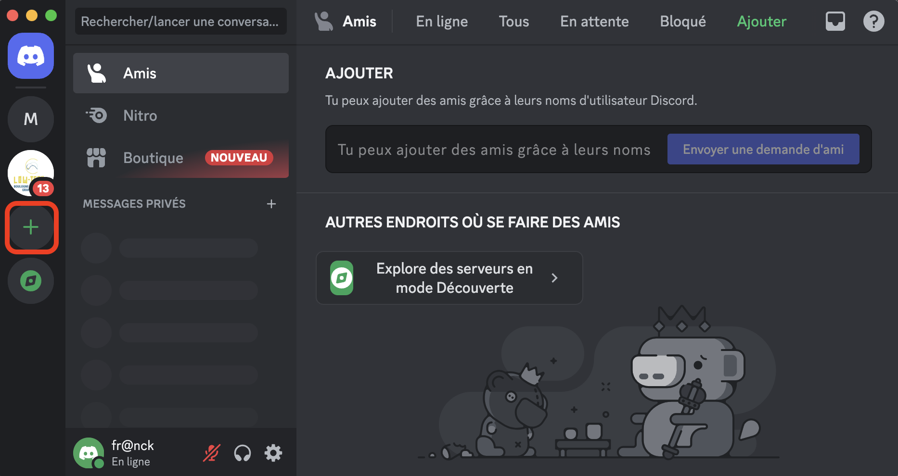

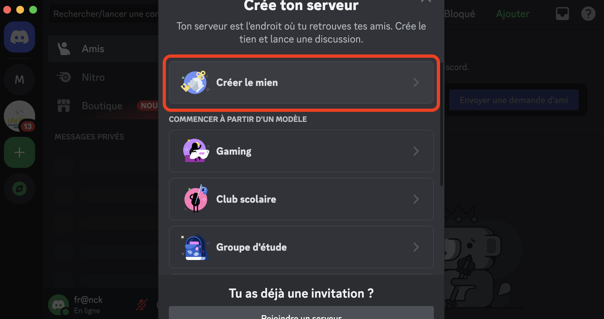


#### Création d'un salon dans notre serveur Discord

Nous souhaitons créer un salon pour chacune de nos applications. La procédure étant la même pour tous les salons, nous montrerons la création du salon pour l'application _*'foo'*_. Vous devrez faire la même chose pour l'application _*'bar'*_.

Sélectionnez le serveur _*'k8s-kind'*_ dans la colonne de gauche, puis dans la partie 'salons textuels', cliquez sur le __'+'__ :


Précisez qu'il s'agit bien d'un salon textuel, précisez son nom _*'foo'*_ et choisissez de le rendre __privé__ :


Passez l'étape d'ajout de membres :

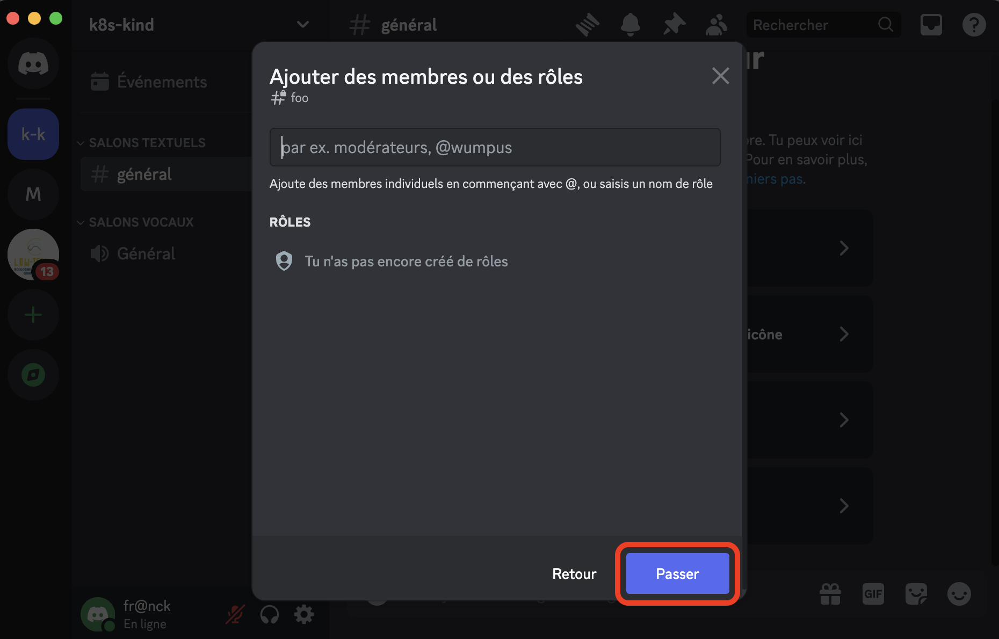

Votre salon est prêt.

#### Création d'un _*'webhook'*_ pour chaque salon

Cliquez sur la roue dentée *'paramètres'* à droite du nom du salon, puis sur *'intégrations'* et enfin sur le bouton *'Créer un webhook'*.

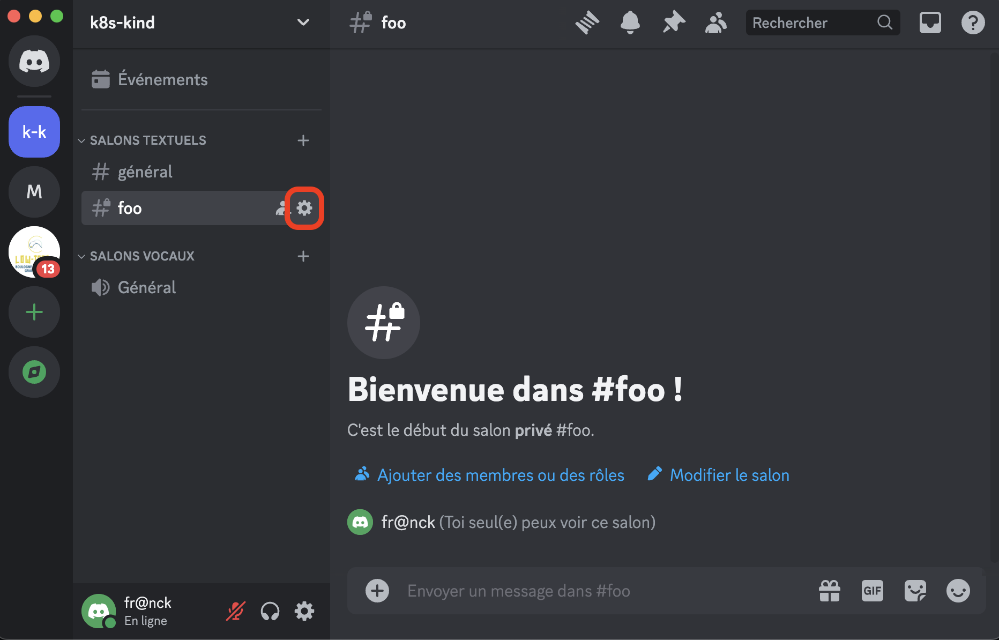

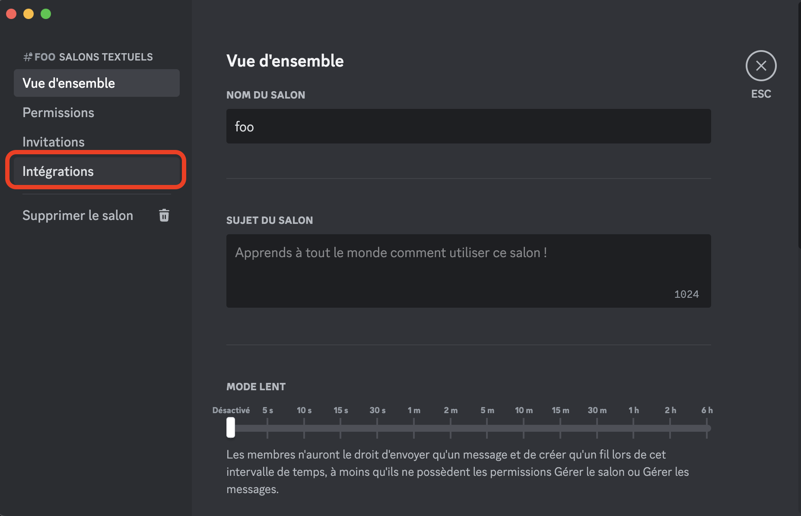


Un nom lui est donné e manière aléatoire (ex: 'Spidey Bot'). Pour changer le nom du *'webhook'* par 'FluxCD', copiez l'URL en cliquant sur le bouton idoine, et enregistrez les modifications :

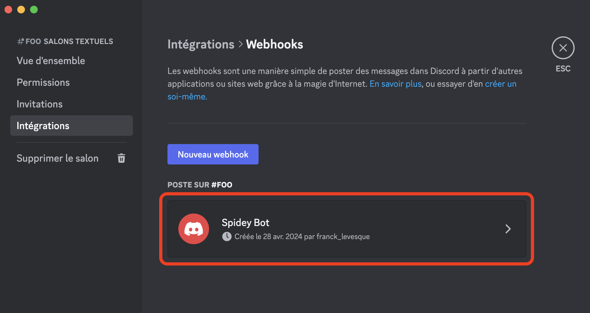

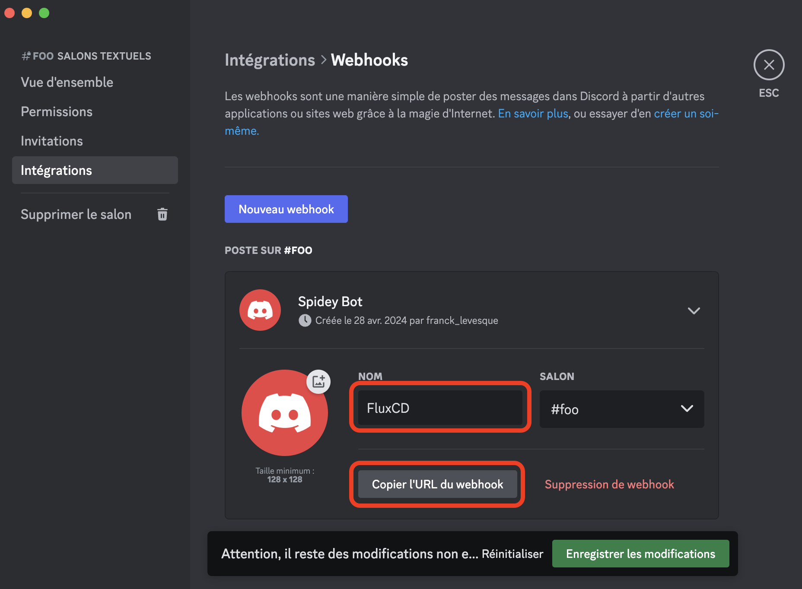

Nous répétons les mêmes opérations pour la création du salon privé _*'bar'*_.

Les URLs des webhooks des salons sont les suivants :

|Salon privé|URL|
|:---:|---|
|**foo**|https://discord.com/api/webhooks/1234167966258561045/z-vEpmh08xnLZHypqKsjzUQd4FwdCDvFWhKAHaJKg7k6YbuU1VfkxqLROXme7ihb8jKP|
|**bar**|https://discord.com/api/webhooks/1234169188231413912/ppnMSjYpE-efPic1AVIGlpZW0m5p_nzj8qiaqldJgd_u_O97Rhm5FJbQLlUg9z5DBC_0|


### Enregistrement des webhook des salons Discord

Ces informations sont considérées comme sensibles dasn la mesure où quiconque en disposerait pourrait publier des informations dans nos salons privés. Nous les enregistrerons dans Kubernetes comme des *'secrets'*.

=== "code"
    ```sh
    export WEBHOOK_FOO="https://discord.com/api/webhooks/1234167966258561045/z-vEpmh08xnLZHypqKsjzUQd4FwdCDvFWhKAHaJKg7k6YbuU1VfkxqLROXme7ihb8jKP"
    export WEBHOOK_BAR="https://discord.com/api/webhooks/1234169188231413912/ppnMSjYpE-efPic1AVIGlpZW0m5p_nzj8qiaqldJgd_u_O97Rhm5FJbQLlUg9z5DBC_0"
    export LOCAL_GITHUB_REPOS="${HOME}/code/github"

    cd ${LOCAL_GITHUB_REPOS}/k8s-kind-fluxcd

    kubectl -n foo create secret generic discord-webhook --from-literal=address=${WEBHOOK_FOO} > apps/foo/discord-webhook.secret.yaml
    kubectl -n bar create secret generic discord-webhook --from-literal=address=${WEBHOOK_FOO} > apps/bar/discord-webhook.secret.yaml
    ```

=== "'foo' webhook"
    ```sh
    
    ```

=== "'bar' webhook"
    ```sh
    
    ```

### Création des _*'notification providers'*_

!!! info
    https://fluxcd.io/flux/components/notification/providers/#discord


=== "code"
    ```sh
    export LOCAL_GITHUB_REPOS="${HOME}/code/github"

    cd ${LOCAL_GITHUB_REPOS}/k8s-kind-fluxcd

    flux create alert-provider discord \
      --type=discord \
      --secret-ref=discord-webhook \
      --channel=foo \
      --username=FluxCD \
      --namespace=foo \
      --export > apps/foo/notification-provider.yaml

    flux create alert-provider discord \
      --type=discord \
      --secret-ref=discord-webhook \
      --channel=bar \
      --username=FluxCD \
      --namespace=bar \
      --export > apps/bar/notification-provider.yaml
    ```

=== "'foo' notification provider"
    ```sh

    ```

=== "'bar' notification provider"
    ```sh

    ```

### Configuration des alertes Discord

=== "code"
    ```sh
    export LOCAL_GITHUB_REPOS="${HOME}/code/github"

    cd ${LOCAL_GITHUB_REPOS}/k8s-kind-fluxcd

    flux create alert discord \
      --event-severity=info \
      --event-source='GitRepository/*,Kustomization/*,ImageRepository/*,ImagePolicy/*,HelmRepository/*' \
      --provider-ref=discord \
      --namespace=foo \
      --export > apps/foo/notification-alert.yaml

    flux create alert discord \
      --event-severity=info \
      --event-source='GitRepository/*,Kustomization/*,ImageRepository/*,ImagePolicy/*,HelmRepository/*' \
      --provider-ref=discord \
      --namespace=bar \
      --export > apps/foo/notification-alert.yaml
    ```

=== "'foo' alert"
    ```sh

    ```

=== "'bar' alert"
    ```sh

    ```


### Activation des alertes et notifications


#### Mise en place

Poussons nos modifications dans notre dépôt GitHub :

```sh
export LOCAL_GITHUB_REPOS="${HOME}/code/github"

cd ${LOCAL_GITHUB_REPOS}/k8s-kind-fluxcd

git add .
git commit -m "feat: setting up Discord alerting."
git push
```


### Tests

Vérifions la bonne création des alertes et notification providers :

=== "code"
    ```sh
    kubectl get providers,alerts -A
    ```

=== "output"
    ```sh

    ```

Testons leur bon fonctionnement : nous allons désactiver les _*'Image Policies'*_ de sorte qu'elles installent la version la plus ancienne des images.

=== "code"
    ```sh
    export LOCAL_GITHUB_REPOS="${HOME}/code/github"

    cd ${LOCAL_GITHUB_REPOS}/k8s-kind-fluxcd

    gsed -i 's/order: asc/order: desc/' apps/foo/agnhost.imagepolicy.yaml
    gsed -i 's/order: asc/order: desc/' apps/foo/agnhost.imagepolicy.yaml

    git add .
    git commit -m "test: changing image policies to test Discord alerting."
    git push
    ```
=== "'foo' image policy"
    ```sh
    ---
    apiVersion: image.toolkit.fluxcd.io/v1beta2
    kind: ImagePolicy
    metadata:
      name: agnhost
      namespace: foo
    spec:
      imageRepositoryRef:
        name: agnhost
      filterTags:
        pattern: '\d\.\d\d'
        extract: ""
      policy:
        numerical:
          order: desc
    ```

=== "'foo' image policy"
    ---
    apiVersion: image.toolkit.fluxcd.io/v1beta2
    kind: ImagePolicy
    metadata:
      name: agnhost
      namespace: bar
    spec:
      imageRepositoryRef:
        name: agnhost
      filterTags:
        pattern: '\d\.\d\d'
        extract: ""
      policy:
        numerical:
          order: desc


=> Mettre des screenshots de Discord et des alertes reçues.

### Rollback

Le test est concluant, revenons à la situation initiale où FluxCD s'assure de déployer la version la plus récente de l'image Docker.

=== "code"
    ```sh
    export LOCAL_GITHUB_REPOS="${HOME}/code/github"

    cd ${LOCAL_GITHUB_REPOS}/k8s-kind-fluxcd

    gsed -i 's/order: desc/order: asc/' apps/foo/agnhost.imagepolicy.yaml
    gsed -i 's/order: desc/order: asc/' apps/foo/agnhost.imagepolicy.yaml

    git add .
    git commit -m "test: rollback to normal."
    git push
    ```


----------
TODO

* mettre screenshots des alertes Discors reçues
* Faire le schéma en mermaid avec les imageupdateautomations, imagepolicies, imagerepositories, gitrepositories etc

